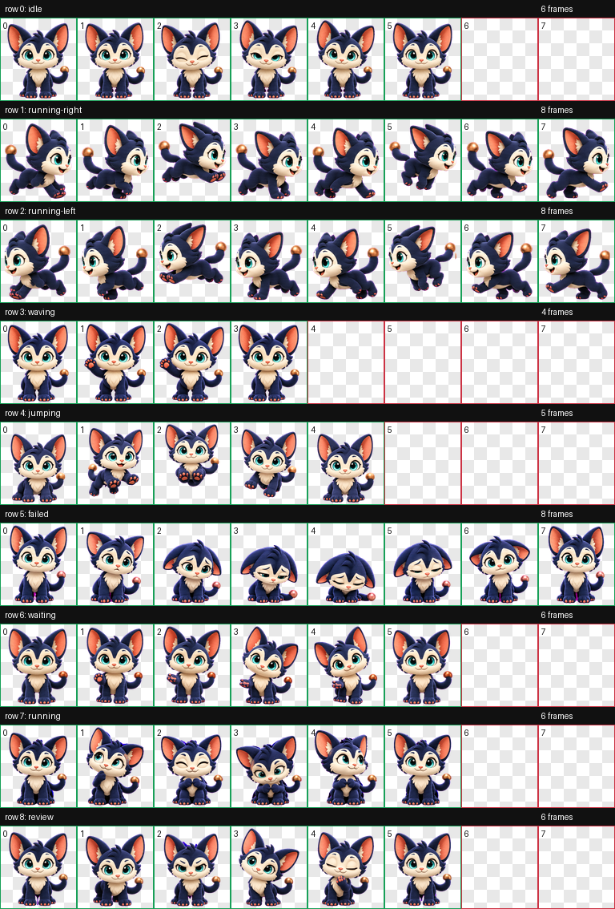
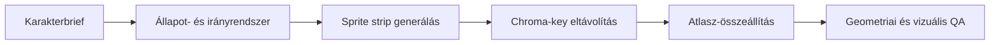

# Moxie — Animated Desktop Pet Showcase

Moxie egy egyedi, 11 állapotsoros, 88 cellás v2 animációs sprite atlasz. A projekt a vizuális karaktertervezést, az animációs állapotmodellt és a gépi minőségellenőrzést kapcsolja össze.

## English summary

Moxie is a custom animated desktop-pet showcase built as a validated 8×11 RGBA sprite atlas. The repository demonstrates state-based character animation, transparent-asset quality checks and a reviewable contact sheet.

## Állapotok

`idle` · `running-right` · `running-left` · `waving` · `jumping` · `failed` · `waiting` · `running` · `review` · 16 irányú `look`

## Atlasz

- méret: 1536 × 2288 px;
- rács: 8 oszlop × 11 sor;
- cellaméret: 192 × 208 px;
- formátum: átlátszó RGBA PNG;
- végső minőségellenőrzés: `ok: true`, hiba és figyelmeztetés nélkül;
- átlátszó pixelekben maradt színadat: 0.

## Folyamat

## Fájlok

- `assets/moxie-v2-spritesheet.png` — végleges v2 atlasz;
- `assets/moxie-contact-sheet.png` — gyors vizuális áttekintés;
- `manifest.json` — állapotok és atlaszparaméterek;
- `validation-summary.json` — publikálható QA-összefoglaló.

Az asset egyedi portfóliómunka; külön engedély nélkül nem használható fel más termékben.
